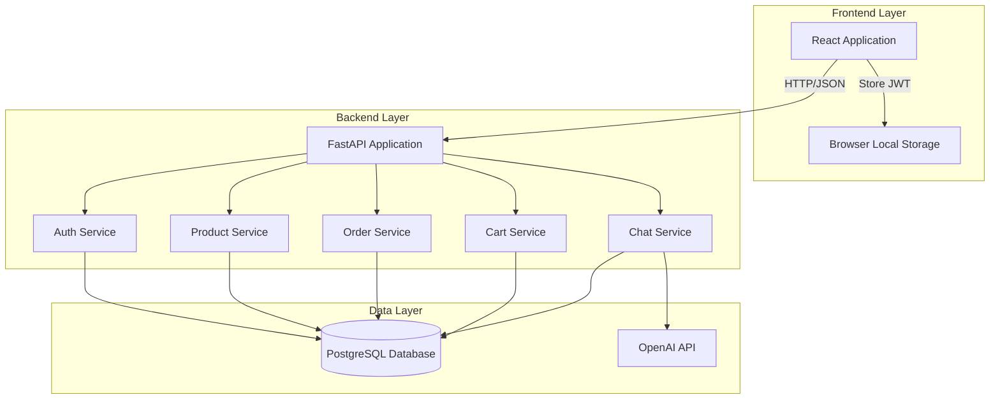
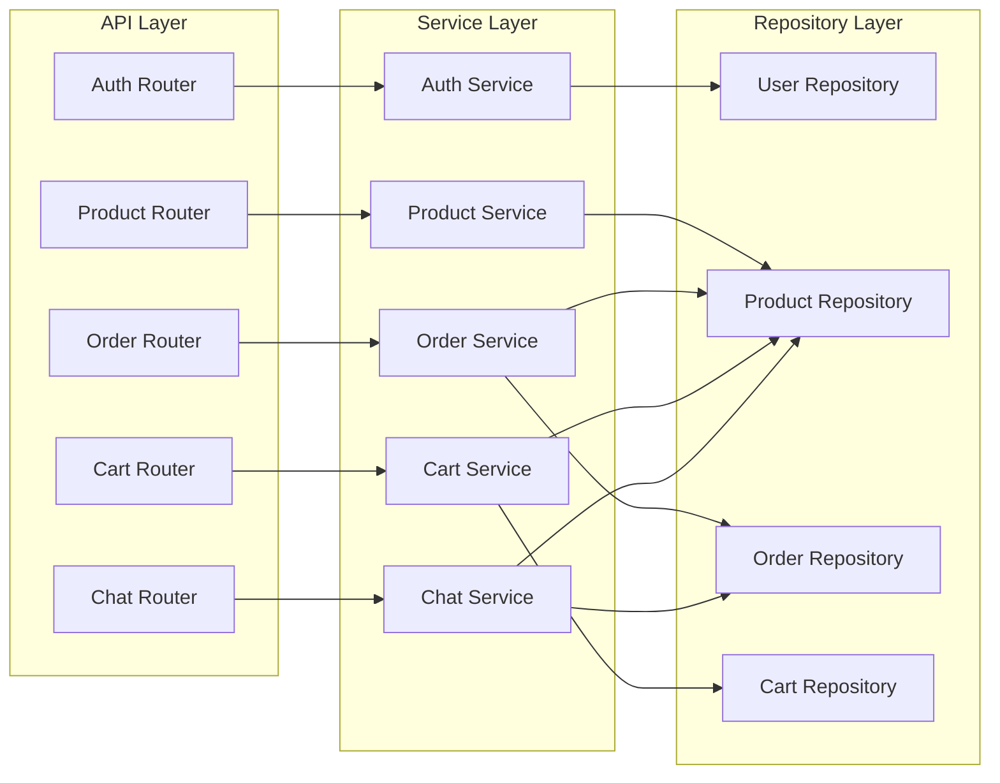
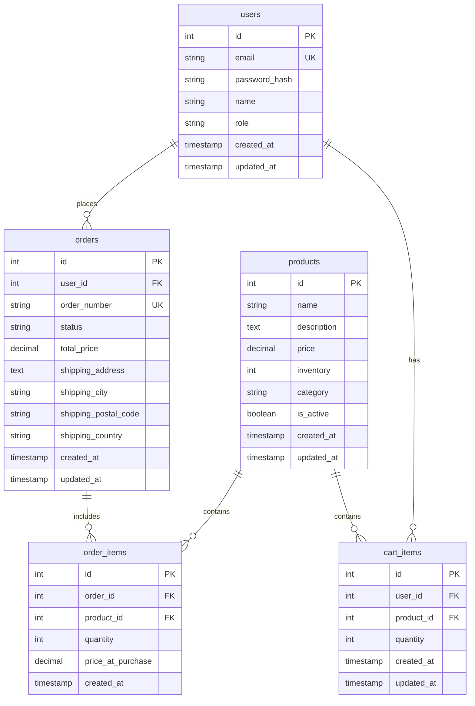
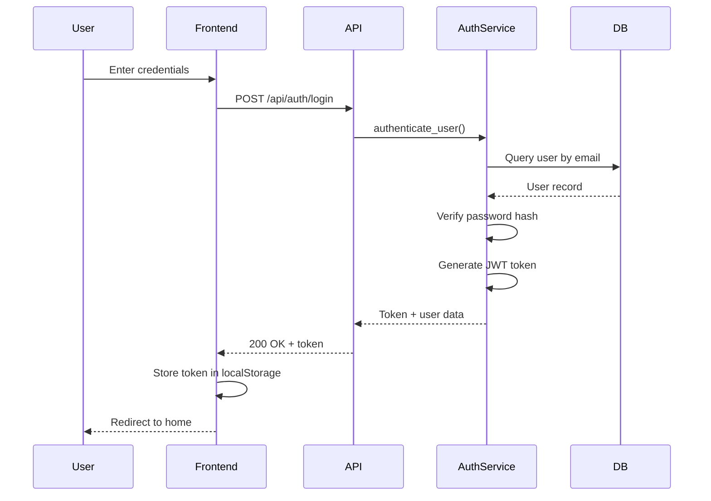
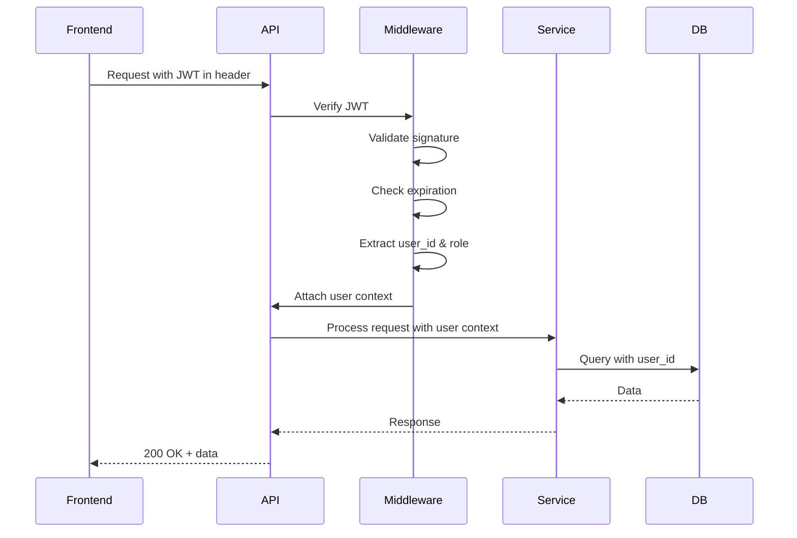
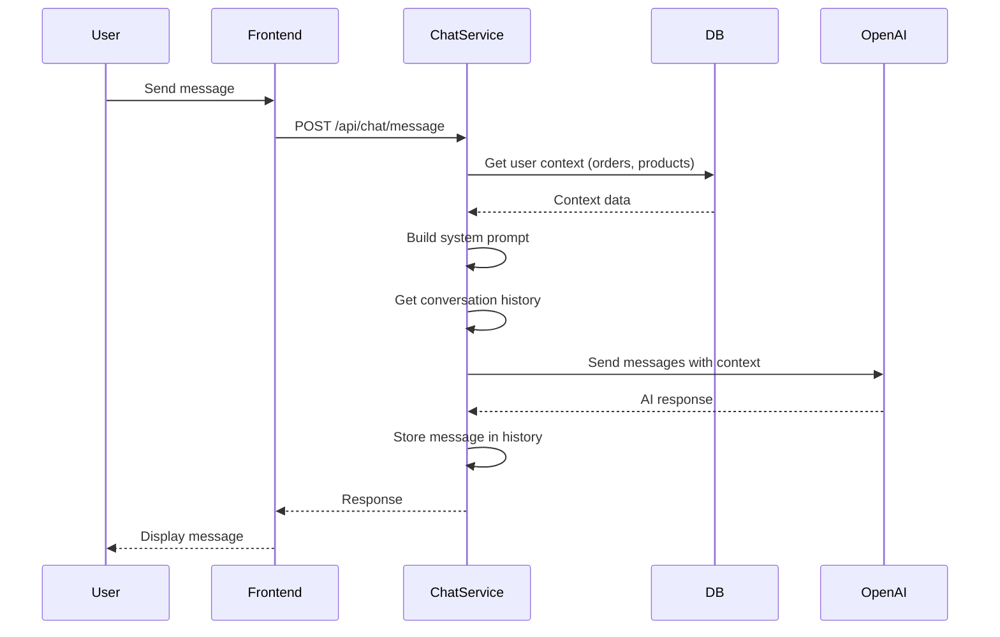

# Design Document: Fullstack E-Commerce Platform

## Overview

This document describes the technical design for a fullstack e-commerce platform built with FastAPI (Python), PostgreSQL, and React. The system enables users to browse products, manage shopping carts, place orders, and interact with an AI chatbot powered by OpenAI. Administrators can manage products and orders through a dedicated interface.

The architecture follows clean architecture principles with clear separation between presentation, business logic, and data access layers. The backend exposes a RESTful API secured with JWT authentication, while the frontend provides an intuitive React-based user interface.

### Key Design Goals

- **Security**: JWT-based authentication with role-based access control
- **Scalability**: Stateless API design with efficient database queries
- **Maintainability**: Modular architecture with clear separation of concerns
- **Reliability**: Transactional consistency for critical operations
- **User Experience**: Fast response times and clear error handling

## Architecture

### System Architecture

The system follows a three-tier architecture:



### Module Architecture



### Technology Stack

**Backend:**
- FastAPI 0.104+ (Python 3.11+)
- SQLAlchemy 2.0+ (ORM)
- Alembic (database migrations)
- Pydantic 2.0+ (data validation)
- python-jose (JWT handling)
- passlib with bcrypt (password hashing)
- psycopg2 (PostgreSQL driver)
- openai (OpenAI API client)

**Database:**
- PostgreSQL 15+

**Frontend:**
- React 18+
- React Router (navigation)
- Axios (HTTP client)
- Context API (state management)

**Development:**
- pytest (backend testing)
- Jest + React Testing Library (frontend testing)
- Docker (containerization)

## Components and Interfaces

### Backend Components

#### 1. Auth Service

**Responsibilities:**
- User registration and credential validation
- Password hashing and verification
- JWT token generation and validation
- Token refresh functionality

**Key Methods:**
```python
class AuthService:
    def register_user(email: str, password: str, name: str) -> User
    def authenticate_user(email: str, password: str) -> User | None
    def create_access_token(user_id: int, role: str) -> str
    def verify_token(token: str) -> TokenPayload
    def refresh_token(token: str) -> str
```

**Dependencies:**
- UserRepository (data access)
- PasswordHasher (password utilities)
- JWTHandler (token utilities)

#### 2. Product Service

**Responsibilities:**
- Product CRUD operations
- Product search and filtering
- Inventory management
- Product validation

**Key Methods:**
```python
class ProductService:
    def create_product(data: ProductCreate) -> Product
    def get_product(product_id: int) -> Product | None
    def list_products(page: int, size: int, category: str | None, search: str | None) -> List[Product]
    def update_product(product_id: int, data: ProductUpdate) -> Product
    def delete_product(product_id: int) -> bool
    def check_inventory(product_id: int, quantity: int) -> bool
```

**Dependencies:**
- ProductRepository (data access)

#### 3. Cart Service

**Responsibilities:**
- Cart item management
- Cart total calculation
- Inventory validation for cart operations
- Cart clearing after order placement

**Key Methods:**
```python
class CartService:
    def add_to_cart(user_id: int, product_id: int, quantity: int) -> CartItem
    def update_cart_item(user_id: int, product_id: int, quantity: int) -> CartItem
    def remove_from_cart(user_id: int, product_id: int) -> bool
    def get_cart(user_id: int) -> Cart
    def clear_cart(user_id: int) -> bool
    def validate_cart_inventory(user_id: int) -> bool
```

**Dependencies:**
- CartRepository (data access)
- ProductRepository (inventory checks)

#### 4. Order Service

**Responsibilities:**
- Order creation and validation
- Inventory deduction
- Order status management
- Order history retrieval
- Transactional consistency

**Key Methods:**
```python
class OrderService:
    def create_order(user_id: int, shipping_info: ShippingInfo) -> Order
    def get_order(order_id: int, user_id: int) -> Order | None
    def list_user_orders(user_id: int) -> List[Order]
    def list_all_orders() -> List[Order]  # Admin only
    def update_order_status(order_id: int, status: OrderStatus) -> Order
    def cancel_order(order_id: int) -> Order
```

**Dependencies:**
- OrderRepository (data access)
- CartService (cart retrieval and clearing)
- ProductRepository (inventory management)

#### 5. Chat Service

**Responsibilities:**
- Message handling and context management
- OpenAI API integration
- Conversation history tracking
- Product and order context injection

**Key Methods:**
```python
class ChatService:
    def send_message(user_id: int, message: str, session_id: str) -> str
    def get_conversation_context(session_id: str) -> List[Message]
    def build_system_prompt(user_id: int) -> str
```

**Dependencies:**
- OpenAI API client
- ProductRepository (product context)
- OrderRepository (order context)

### API Endpoints

#### Auth Endpoints

```
POST   /api/auth/register
POST   /api/auth/login
POST   /api/auth/refresh
GET    /api/auth/me
```

#### Product Endpoints

```
GET    /api/products              # List products (public)
GET    /api/products/{id}         # Get product details (public)
POST   /api/products              # Create product (admin)
PUT    /api/products/{id}         # Update product (admin)
DELETE /api/products/{id}         # Delete product (admin)
```

#### Cart Endpoints

```
GET    /api/cart                  # Get user cart (authenticated)
POST   /api/cart/items            # Add to cart (authenticated)
PUT    /api/cart/items/{id}       # Update cart item (authenticated)
DELETE /api/cart/items/{id}       # Remove from cart (authenticated)
```

#### Order Endpoints

```
POST   /api/orders                # Create order (authenticated)
GET    /api/orders                # List user orders (authenticated)
GET    /api/orders/{id}           # Get order details (authenticated)
GET    /api/admin/orders          # List all orders (admin)
PUT    /api/admin/orders/{id}     # Update order status (admin)
```

#### Chat Endpoints

```
POST   /api/chat/message          # Send message (authenticated)
GET    /api/chat/history/{session_id}  # Get conversation history (authenticated)
```

### Frontend Components

#### Page Components

1. **HomePage**: Product grid with search and filtering
2. **ProductDetailPage**: Individual product information
3. **CartPage**: Shopping cart management
4. **CheckoutPage**: Order placement form
5. **OrderHistoryPage**: User's past orders
6. **LoginPage**: Authentication form
7. **RegisterPage**: User registration form
8. **AdminDashboard**: Admin overview
9. **AdminProductsPage**: Product management
10. **AdminOrdersPage**: Order management
11. **ChatWidget**: AI chatbot interface

#### Shared Components

1. **Navbar**: Navigation with cart badge
2. **ProductCard**: Product display in grid
3. **CartItem**: Individual cart item
4. **OrderCard**: Order summary display
5. **ProtectedRoute**: Authentication guard
6. **AdminRoute**: Admin authorization guard
7. **ErrorBoundary**: Error handling wrapper
8. **LoadingSpinner**: Loading state indicator

#### Context Providers

1. **AuthContext**: User authentication state and JWT management
2. **CartContext**: Cart state and operations
3. **NotificationContext**: Toast notifications for user feedback

## Data Models

### Database Schema



### Pydantic Models

#### User Models

```python
class UserBase(BaseModel):
    email: EmailStr
    name: str

class UserCreate(UserBase):
    password: str  # min 8 characters

class UserResponse(UserBase):
    id: int
    role: str
    created_at: datetime

class LoginRequest(BaseModel):
    email: EmailStr
    password: str

class TokenResponse(BaseModel):
    access_token: str
    token_type: str = "bearer"
```

#### Product Models

```python
class ProductBase(BaseModel):
    name: str  # max 200 characters
    description: str  # max 2000 characters
    price: Decimal  # positive, 2 decimal places
    inventory: int  # non-negative
    category: str | None = None

class ProductCreate(ProductBase):
    pass

class ProductUpdate(BaseModel):
    name: str | None = None
    description: str | None = None
    price: Decimal | None = None
    inventory: int | None = None
    category: str | None = None

class ProductResponse(ProductBase):
    id: int
    is_active: bool
    created_at: datetime
    updated_at: datetime
```

#### Cart Models

```python
class CartItemCreate(BaseModel):
    product_id: int
    quantity: int  # positive

class CartItemUpdate(BaseModel):
    quantity: int  # positive

class CartItemResponse(BaseModel):
    id: int
    product: ProductResponse
    quantity: int
    subtotal: Decimal

class CartResponse(BaseModel):
    items: List[CartItemResponse]
    total: Decimal
```

#### Order Models

```python
class ShippingInfo(BaseModel):
    address: str
    city: str
    postal_code: str
    country: str

class OrderCreate(BaseModel):
    shipping_info: ShippingInfo

class OrderItemResponse(BaseModel):
    id: int
    product_id: int
    product_name: str
    quantity: int
    price_at_purchase: Decimal

class OrderResponse(BaseModel):
    id: int
    order_number: str
    status: str
    total_price: Decimal
    shipping_address: str
    shipping_city: str
    shipping_postal_code: str
    shipping_country: str
    items: List[OrderItemResponse]
    created_at: datetime

class OrderStatusUpdate(BaseModel):
    status: str  # enum: pending, processing, shipped, delivered, cancelled
```

#### Chat Models

```python
class ChatMessage(BaseModel):
    message: str  # max 1000 characters
    session_id: str | None = None

class ChatResponse(BaseModel):
    response: str
    session_id: str
```

### Database Constraints

**Primary Keys:**
- All tables have auto-incrementing integer primary keys

**Unique Constraints:**
- `users.email`
- `orders.order_number`

**Foreign Keys:**
- `cart_items.user_id` → `users.id` (CASCADE on delete)
- `cart_items.product_id` → `products.id` (RESTRICT on delete)
- `orders.user_id` → `users.id` (RESTRICT on delete)
- `order_items.order_id` → `orders.id` (CASCADE on delete)
- `order_items.product_id` → `products.id` (RESTRICT on delete)

**Check Constraints:**
- `products.price > 0`
- `products.inventory >= 0`
- `cart_items.quantity > 0`
- `order_items.quantity > 0`
- `order_items.price_at_purchase > 0`

**Indexes:**
- `users.email` (unique index)
- `products.name` (for search)
- `products.category` (for filtering)
- `products.is_active` (for active product queries)
- `orders.user_id` (for user order history)
- `orders.created_at` (for sorting)
- `orders.order_number` (unique index)

### Validation Rules

**Email Validation:**
- Must follow RFC 5322 format
- Validated using Pydantic's EmailStr

**Password Validation:**
- Minimum 8 characters
- Hashed using bcrypt with salt rounds = 12

**Product Validation:**
- Name: 1-200 characters
- Description: 0-2000 characters
- Price: Positive decimal with 2 decimal places
- Inventory: Non-negative integer
- Category: Optional string, 0-100 characters

**Cart Validation:**
- Quantity: Positive integer
- Must not exceed available inventory

**Order Validation:**
- All cart items must have sufficient inventory
- Shipping address fields: Required, 1-500 characters each
- Postal code: 1-20 characters
- Country: 1-100 characters

**Chat Validation:**
- Message: 1-1000 characters
- Session ID: UUID format


## Security Architecture

### Authentication Flow



### Authorization Flow



### JWT Token Structure

**Payload:**
```json
{
  "sub": "user_id",
  "role": "user|admin",
  "exp": "expiration_timestamp",
  "iat": "issued_at_timestamp"
}
```

**Configuration:**
- Algorithm: HS256
- Secret: Environment variable `JWT_SECRET_KEY`
- Expiration: 24 hours
- Refresh: Supported via `/api/auth/refresh` endpoint

### Password Security

- Hashing algorithm: bcrypt
- Salt rounds: 12
- Passwords never stored in plain text
- Passwords never logged or returned in API responses

### API Security Measures

1. **CORS Configuration**: Restrict origins to frontend domain
2. **Rate Limiting**: Implement rate limiting on auth endpoints
3. **SQL Injection Prevention**: Use parameterized queries via SQLAlchemy
4. **XSS Prevention**: Sanitize user input, use Content-Security-Policy headers
5. **HTTPS Only**: Enforce HTTPS in production
6. **Environment Variables**: Store secrets in environment variables, never in code

### Role-Based Access Control

**User Role:**
- Access own cart
- Place orders
- View own order history
- Use chatbot
- Browse products

**Admin Role:**
- All user permissions
- Create/update/delete products
- View all orders
- Update order status
- Access admin dashboard

## Transaction Handling

### Order Creation Transaction

Order creation is a critical operation that must maintain data consistency across multiple tables. The following operations must execute atomically:

```python
async def create_order(user_id: int, shipping_info: ShippingInfo) -> Order:
    async with db.begin():  # Start transaction
        # 1. Validate cart has items
        cart = await cart_service.get_cart(user_id)
        if not cart.items:
            raise ValueError("Cart is empty")
        
        # 2. Validate inventory for all items
        for item in cart.items:
            if not await product_service.check_inventory(item.product_id, item.quantity):
                raise InsufficientInventoryError(item.product.name)
        
        # 3. Create order record
        order = await order_repo.create(user_id, shipping_info, cart.total)
        
        # 4. Create order items
        for item in cart.items:
            await order_item_repo.create(order.id, item.product_id, item.quantity, item.product.price)
        
        # 5. Reduce inventory
        for item in cart.items:
            await product_repo.reduce_inventory(item.product_id, item.quantity)
        
        # 6. Clear cart
        await cart_service.clear_cart(user_id)
        
        # Transaction commits automatically if no exceptions
        return order
```

**Rollback Scenarios:**
- Insufficient inventory for any item → rollback entire transaction
- Database constraint violation → rollback entire transaction
- Any exception during process → rollback entire transaction

### Order Cancellation Transaction

When an admin cancels an order, inventory must be restored:

```python
async def cancel_order(order_id: int) -> Order:
    async with db.begin():  # Start transaction
        # 1. Get order with items
        order = await order_repo.get_with_items(order_id)
        
        # 2. Validate order can be cancelled
        if order.status in ["shipped", "delivered"]:
            raise ValueError("Cannot cancel shipped or delivered orders")
        
        # 3. Restore inventory
        for item in order.items:
            await product_repo.increase_inventory(item.product_id, item.quantity)
        
        # 4. Update order status
        order.status = "cancelled"
        await order_repo.update(order)
        
        return order
```

## OpenAI Integration

### Chat Service Architecture



### System Prompt Template

```python
SYSTEM_PROMPT = """
You are a helpful e-commerce assistant for our online store.

Available Products:
{product_list}

User's Recent Orders:
{order_history}

Your role is to:
- Help users find products
- Answer questions about orders
- Provide product recommendations
- Assist with general shopping questions

Be friendly, concise, and helpful. If you don't know something, admit it.
"""
```

### Conversation Context Management

- Store last 10 messages per session in memory
- Session ID: UUID generated on first message
- Context includes: user messages, assistant responses, timestamps
- Context cleared after 30 minutes of inactivity

### OpenAI Configuration

```python
openai_config = {
    "model": "gpt-3.5-turbo",
    "max_tokens": 500,
    "temperature": 0.7,
    "top_p": 1.0,
    "frequency_penalty": 0.0,
    "presence_penalty": 0.0
}
```

### Error Handling

**OpenAI API Errors:**
- Rate limit exceeded → Return "Service temporarily busy, please try again"
- Invalid API key → Log error, return "Chat service unavailable"
- Timeout → Return "Request timed out, please try again"
- Network error → Return "Connection error, please check your internet"

**Fallback Response:**
```
"I apologize, but I'm having trouble processing your request right now. Please try again in a moment, or contact our support team for immediate assistance."
```

